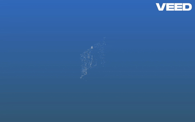

# 3D Reconstruction- Structure from Motion (SfM)

<table border="0">
  <tr style="border: none;">
    <td align="center" colspan="2" style="border: none;"><strong>Input Images</strong></td>
    <td align="center" style="border: none;"><strong>3D Sparse Output</strong></td>
  </tr>
  <tr style="border: none;">
    <td align="center" style="border: none;">
      
      <br /><em>Left (0001.png)</em>
    </td>
    <td align="center" style="border: none;">
      
      <br /><em>Right (0002.png)</em>
    </td>
    <td align="center" style="border: none;">
      
    </td>
  </tr>
</table>

A lightweight, research-oriented Python implementation of a 3D reconstruction pipeline using Structure from Motion (SfM). This project handles both baseline two-view reconstruction and sequence-based multi-view reconstruction utilizing sparse feature tracking, epipolar geometry estimation, and triangulation.

## Features & Pipeline Architecture

The pipeline processes sequential or topological image sets to reconstruct sparse 3D point clouds through the following stages:

1. **Feature Detection & Matching**: Implements SIFT keypoint extraction paired with a FLANN-based KD-Tree matcher and Lowe's ratio test.
2. **Epipolar Geometry Estimation**: Computes the `Fundamental Matrix (F)` via RANSAC filtering to isolate geometric inliers and map corresponding epipolar lines.
3. **Intrinsic Calibration & Essential Matrix**: Incorporates a known camera intrinsic matrix $K$ to solve for the `Essential Matrix (E)`.
4. **Pose Recovery**: Decomposes the Essential Matrix to resolve the relative rotation $R$ and translation $t$ while enforcing chirality constraints via point visualization.
5. **Triangulation**: Projects normalized homogeneous coordinates into 3D space using linear triangulation.
6. **Topological Multi-View Reconstruction**: Supports customizable tracking topologies (`overlapping`, `adjacent`, `360`, `skipping`) to iteratively parse full image sequences into a unified global coordinate frame.

---

## Technical Specifications & Environment

### Dependencies
* **Core Vision**: `opencv-python`, `numpy`
* **Visualization**: `matplotlib`, `plotly`
* **File I/O**: `plyfile`

### Dataset
The implementation is validated on the **Fountain** benchmark sequence, evaluating camera matrix alignment and sparse 3D scene geometry.

$$\mathbf{K} = \begin{bmatrix} 2759.48 & 0 & 1520.69 \\ 0 & 2764.16 & 1006.81 \\ 0 & 0 & 1 \end{bmatrix}$$

---


## Core Algorithmic Breakdown

### 1. Two-View Baseline Initialization
The pipeline establishes an initial 3D coordinate frame by computing relative camera pose geometry from a calibrated image pair. This initialization phase executes the following sequence:

* **Robust Feature Correspondence**: Extract SIFT keypoints and generate descriptors across target views. Initial matching is performed via an accelerated FLANN matcher utilizing dual-tree KD-trees, filtered by Lowe's empirical ratio test ($d_1 / d_2 < 0.7$) to eliminate ambiguous matches.
* **Epipolar Geometry Estimation**: Compute the 3x3 `Fundamental Matrix (F)` mapping points in the first image to epipolar lines in the second ($x'^T F x = 0$). Outliers resulting from periodic textures or mismatched features are robustly rejected using a Random Sample Consensus (RANSAC) framework with a strict pixel error threshold.

```python
# Feature tracking & descriptor matching
kp1, desc1, kp2, desc2, matches = GetImageMatches(img1, img2)
img1pts, img2pts, _, _ = GetAlignedMatches(kp1, desc1, kp2, desc2, matches)

# Structural outlier rejection via Epipolar RANSAC filtering
F, mask = cv2.findFundamentalMat(img1pts, img2pts, cv2.FM_RANSAC, 3.0, 0.99)

### 2. Relative Pose Recovery & Triangulation
Once a clean set of inlier correspondences is established, the algebraic relations are promoted to Euclidean space using the known camera intrinsics matrix $K$:Essential Matrix Decomposition: Compute $\mathbf{E} = \mathbf{K}^T \mathbf{F} \mathbf{K}$. The Essential Matrix is decomposed into four possible relative camera pose configurations $[R|t]$ via Singular Value Decomposition (SVD).Chirality Constraint Verification: Perform a positive depth check (chirality test) via cv2.recoverPose to isolate the single valid rotation $R$ and translation $t$ where the triangulated 3D points lie strictly in front of both camera centers.Linear Triangulation: Back-project the normalized 2D point coordinates into homogeneous 3D space, solving the intersecting ray equations via standard linear triangulation methods.

```Python
# Scale-invariant Essential Matrix calculation
E, mask_E = cv2.findEssentialMat(img1pts, img2pts, K, cv2.RANSAC, 0.999, 1.0)

# Decompose E and enforce chirality constraints
_, R, t, _ = cv2.recoverPose(E, img1pts, img2pts, cameraMatrix=K, mask=mask_E)

# Back-projection to 3D Euclidean coordinates
pts3d = GetTriangulatedPts(img1pts, img2pts, K, R, t)


